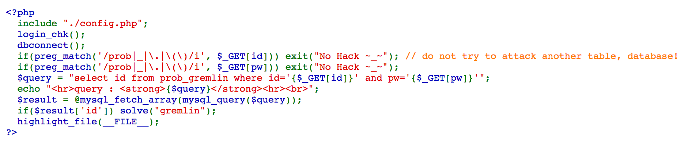
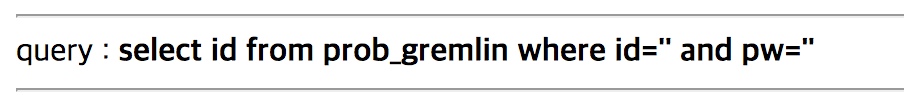

# Lord of SQL Injection Write-up

Write-up for [Lord of SQL Injection](http://los.eagle-jump.org/)

Visual Studio Code를 이용하여 작성

iTerm2 + Git Command Line Tools와 Visual Studio Code 소스 제어 창을 함께 이용하여 버전 관리

[**1번 문제 - Gremlin**](https://github.com/infreljs/los_writeup/blob/master/writeUp/los_no1_gremlin.md) / [**2번 문제 - Cobolt**](https://github.com/infreljs/los_writeup/blob/master/writeUp/los_no2_cobolt.md) / [**3번 문제 - Goblin**](https://github.com/infreljs/los_writeup/blob/master/writeUp/los_no3_goblin.md) / [**4번 문제 - Orc**](https://github.com/infreljs/los_writeup/blob/master/writeUp/los_no4_orc.md) / [**5번 문제 - Wolfman**](https://github.com/infreljs/los_writeup/blob/master/writeUp/los_no5_wolfman.md)

[**6번 문제 - Darkelf**](https://github.com/infreljs/los_writeup/blob/master/writeUp/los_no6_darkelf.md) / [**7번 문제 - Orge**](https://github.com/infreljs/los_writeup/blob/master/writeUp/los_no7_orge.md) / [**8번 문제 - Troll**](https://github.com/infreljs/los_writeup/blob/master/writeUp/los_no8_troll.md) / [**9번 문제 - Vampire**](https://github.com/infreljs/los_writeup/blob/master/writeUp/los_no9_vampire.md) / [**10번 문제 - Skeleton**](https://github.com/infreljs/los_writeup/blob/master/writeUp/los_no10_skeleton.md)

[**11번 문제 - Golem**](https://github.com/infreljs/los_writeup/blob/master/writeUp/los_no11_golem.md) / [**12번 문제 - Darkknight**](https://github.com/infreljs/los_writeup/blob/master/writeUp/los_no12_darkknight.md) / [**13번 문제 - Bugbear**](https://github.com/infreljs/los_writeup/blob/master/writeUp/los_no13_bugbear.md) / [**14번 문제 - Giant**](https://github.com/infreljs/los_writeup/blob/master/writeUp/los_no14_giant.md) / [**15번 문제 - Assassin**](https://github.com/infreljs/los_writeup/blob/master/writeUp/los_no15_assassin.md)

[**16번 문제 - Zombie Assassin**](https://github.com/infreljs/los_writeup/blob/master/writeUp/los_no16_zombie_assassin.md) / [**17번 문제 - Succubus**](https://github.com/infreljs/los_writeup/blob/master/writeUp/los_no17_succubus.md) / [**18번 문제 - Nigntmare**](https://github.com/infreljs/los_writeup/blob/master/writeUp/los_no18_nightmare.md) / [**19번 문제 - Xavis**](https://github.com/infreljs/los_writeup/blob/master/writeUp/los_no19_xavis.md) / [**20번 문제 - Dragon**](https://github.com/infreljs/los_writeup/blob/master/writeUp/los_no20_dragon.md)

[**21번 문제 - Iron Golem**](https://github.com/infreljs/los_writeup/blob/master/writeUp/los_no21_iron_golem.md) / [**22번 문제 - Dark Eyes**](https://github.com/infreljs/los_writeup/blob/master/writeUp/los_no22_dark_eyes.md) / [~~**23번 문제 - Hell Fire**~~](https://github.com/infreljs/los_writeup/blob/master/writeUp/los_no23_hell_fire.md) / [~~**24번 문제 - Evil Wizard**~~](https://github.com/infreljs/los_writeup/blob/master/writeUp/los_no24_evil_wizard.md) / [**25번 문제 - Umaru**](https://github.com/infreljs/los_writeup/blob/master/writeUp/los_no25_umaru.md)

# Lord of SQL Injection

## 소개

* Lord of SQL Injection은 2015년 제작된 SQL Injection Wargame 사이트이다.
* 총 25문제로 구성되어 있으나 2017년 9월 4일 기준 23번 hell_fire 문제와 24번 evil_wizard 문제가 broken 되어 그냥 넘겨진다.
* SQL Injection의 기초적인 원리부터 Blind SQL Injection의 방법까지 다양한 지식을 필요로 하며 접할 수 있다.

## 특징

* Lord of SQL Injection의 모든 문제는 php 소스 코드를 공개해 준다.

    

* 또, 25번 Umaru 문제를 제외한 모든 문제는 다음과 같이 query를 공개해 준다.

    

* 이를 이용하여 각 문제의 solve("[문제 이름]") 함수를 실행시키면 문제가 풀린다.
